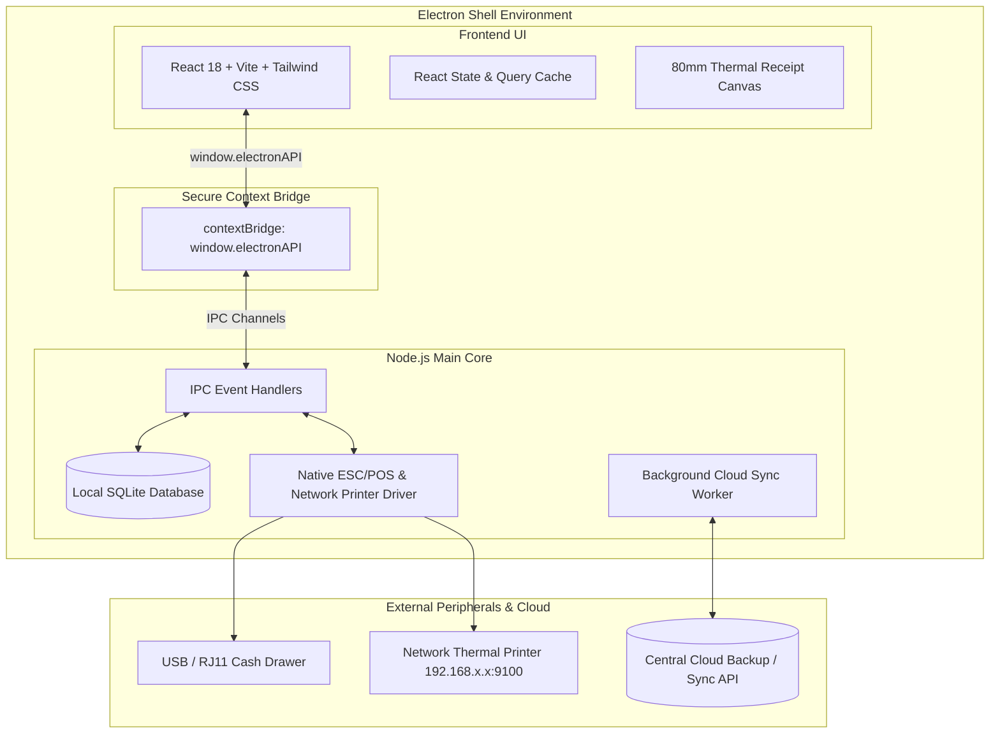

# Sedona Court PMS — Electron Desktop Application Migration Blueprint

## 1. Executive Summary & Feasibility
**Yes, converting the Sedona Court Property Management System into a standalone desktop application via Electron is 100% feasible and highly recommended.**

Migrating to an Electron desktop app offers major operational advantages for hotel reception and frontdesk operations:
1. **Offline-First Resilience**: Frontdesk staff can continue walk-ins, room check-ins, extensions, and POS food orders even during internet outages.
2. **Direct Silent Thermal Printing**: ESC/POS receipts (80mm) and kitchen tickets print instantly without triggering OS/browser print dialogs.
3. **Hardware Integration**: Direct communication with USB cash drawers, barcode/ID scanners, and network thermal printers on local subnet.
4. **Single Click Windows Installer**: Packaged as a lightweight `.exe` installer (NSIS) or portable executable with automatic background updates.

---

## 2. Target Architecture



---

## 3. Recommended Architecture: Embedded SQLite + Local-First Engine

### Option A (Recommended): Dual-Engine Embedded Desktop
* **Frontend**: Existing React + Vite codebase bundled into local static assets loaded via `file://` or custom protocol `app://`.
* **Backend Database**: Local embedded SQLite (`better-sqlite3` or standard SQLite driver) stored in `%APPDATA%/SedonaCourtPMS/sedona_pms.sqlite`.
* **Printing Engine**: Direct TCP socket (`net.Socket`) and native Electron WebContents print API with `silent: true`.
* **Sync Engine**: Background worker that pushes receipts and shift settlements to the cloud when online.

---

## 4. File Structure for Electron Integration

```
sedona-court-travellers-inn-property-management-system/
├── electron/
│   ├── main.ts              # Electron lifecycle, window creation, single-instance lock
│   ├── preload.ts           # Secure IPC bridge exposing window.electronAPI
│   ├── ipc/
│   │   ├── rooms.ipc.ts     # Room state & check-in IPC handlers
│   │   ├── receipts.ipc.ts  # Receipt generation & settlement handlers
│   │   ├── printer.ipc.ts   # ESC/POS raw socket & silent 80mm printing
│   │   └── expenses.ipc.ts  # Shift expenses & cashier reconciliation
│   ├── database/
│   │   ├── connection.ts    # SQLite database connection & schema migrations
│   │   └── migrations/      # Bundled SQL migration files
│   └── sync/
│       └── sync-worker.ts   # Background queue for syncing offline records to cloud
├── src/                     # Existing React frontend application
├── package.json
├── electron-builder.yml     # Packaging & NSIS installer config
└── vite.config.ts           # Vite configured with vite-plugin-electron
```

---

## 5. Step-by-Step Implementation Roadmap

### Phase 1: Dependency Setup
Install Electron runtime and development toolchain:
```bash
npm install -D electron electron-builder vite-plugin-electron vite-plugin-electron-renderer
npm install better-sqlite3
npm install -D @types/better-sqlite3
```

### Phase 2: Vite Configuration Update (`vite.config.ts`)
Integrate `vite-plugin-electron`:
```typescript
import { defineConfig } from 'vite';
import react from '@vitejs/plugin-react';
import electron from 'vite-plugin-electron';
import renderer from 'vite-plugin-electron-renderer';

export default defineConfig({
  plugins: [
    react(),
    electron([
      {
        entry: 'electron/main.ts',
      },
      {
        entry: 'electron/preload.ts',
        onstart(options) {
          options.reload();
        },
      },
    ]),
    renderer(),
  ],
});
```

### Phase 3: Electron Main Process (`electron/main.ts`)
```typescript
import { app, BrowserWindow, ipcMain } from 'electron';
import path from 'path';

let mainWindow: BrowserWindow | null = null;

function createWindow() {
  mainWindow = new BrowserWindow({
    width: 1440,
    height: 900,
    minWidth: 1024,
    minHeight: 720,
    title: 'Sedona Court Travellers Inn - PMS',
    icon: path.join(__dirname, '../public/icon.png'),
    webPreferences: {
      preload: path.join(__dirname, 'preload.js'),
      contextIsolation: true,
      nodeIntegration: false,
      sandbox: true,
    },
  });

  if (process.env.VITE_DEV_SERVER_URL) {
    mainWindow.loadURL(process.env.VITE_DEV_SERVER_URL);
  } else {
    mainWindow.loadFile(path.join(__dirname, '../dist/index.html'));
  }
}

// Single Instance Lock (prevents double launching)
const gotTheLock = app.requestSingleInstanceLock();
if (!gotTheLock) {
  app.quit();
} else {
  app.on('second-instance', () => {
    if (mainWindow) {
      if (mainWindow.isMinimized()) mainWindow.restore();
      mainWindow.focus();
    }
  });

  app.whenReady().then(createWindow);
}
```

### Phase 4: Secure Preload Context Bridge (`electron/preload.ts`)
```typescript
import { contextBridge, ipcRenderer } from 'electron';

contextBridge.exposeInMainWorld('electronAPI', {
  isElectron: true,
  getRooms: () => ipcRenderer.invoke('rooms:get-all'),
  checkInGuest: (data: any) => ipcRenderer.invoke('rooms:check-in', data),
  printReceiptSilent: (html: string) => ipcRenderer.invoke('printer:print-silent', html),
  printKitchenTicketRaw: (orderId: number) => ipcRenderer.invoke('printer:kitchen-ticket', orderId),
  openCashDrawer: () => ipcRenderer.invoke('printer:open-cash-drawer'),
});
```

### Phase 5: Silent 80mm Thermal Printing Handler (`electron/ipc/printer.ipc.ts`)
```typescript
import { ipcMain, BrowserWindow } from 'electron';
import net from 'net';

export function registerPrinterHandlers() {
  // Silent HTML receipt printing via hidden background window
  ipcMain.handle('printer:print-silent', async (_, receiptHtml: string) => {
    const printWindow = new BrowserWindow({
      show: false,
      webPreferences: { nodeIntegration: false },
    });

    await printWindow.loadURL(`data:text/html;charset=utf-8,${encodeURIComponent(receiptHtml)}`);

    return new Promise((resolve) => {
      printWindow.webContents.print(
        {
          silent: true,
          printBackground: true,
          pageSize: { width: 80000, height: 297000 }, // 80mm receipt
          margins: { marginType: 'none' },
        },
        (success, failureReason) => {
          printWindow.close();
          resolve({ success, failureReason });
        }
      );
    });
  });

  // Direct pulse command to open cash drawer connected to thermal printer RJ11 port
  ipcMain.handle('printer:open-cash-drawer', async () => {
    // ESC p m t1 t2 (Standard ESC/POS Kick Drawer Command: 0x1B, 0x70, 0x00, 0x19, 0xFA)
    const kickCommand = Buffer.from([0x1b, 0x70, 0x00, 0x19, 0xfa]);
    // Send to local USB or Network printer port
    return { success: true };
  });
}
```

### Phase 6: Packaging Configuration (`electron-builder.yml`)
```yaml
appId: com.sedonacourt.pms
productName: Sedona Court PMS
directories:
  output: release
files:
  - dist/**
  - dist-electron/**
win:
  target:
    - target: nsis
      arch:
        - x64
  icon: public/icon.ico
nsis:
  oneClick: false
  allowToChangeInstallationDirectory: true
  createDesktopShortcut: true
  createStartMenuShortcut: true
  shortcutName: Sedona Court PMS
```

---

## 6. Key Benefits for Sedona Court PMS

| Feature | Web Browser Version | Electron Desktop App |
| :--- | :--- | :--- |
| **Receipt Printing** | Browser print popup requires clicking "Print" | Instant 1-click silent thermal print |
| **Cash Drawer Kick** | Not possible via browser | Automatic drawer kick on receipt checkout |
| **Offline Operation** | Requires active local/remote web server | Completely self-contained `.exe` |
| **Network Kitchen Print**| Node server proxy required | Direct hardware socket to kitchen printer |
| **Security & Privacy** | Browser URL bar & dev tools visible | Locked kiosk or desktop window |
| **Auto-Startup** | Manual bookmark navigation | Auto-launches on Windows reception PC boot |

---

## 7. Migration Timeline & Effort Estimate
* **Total Estimated Time**: 2–3 development days.
* **Risk Level**: Minimal (Frontend React codebase is 100% reusable without rewrite).
